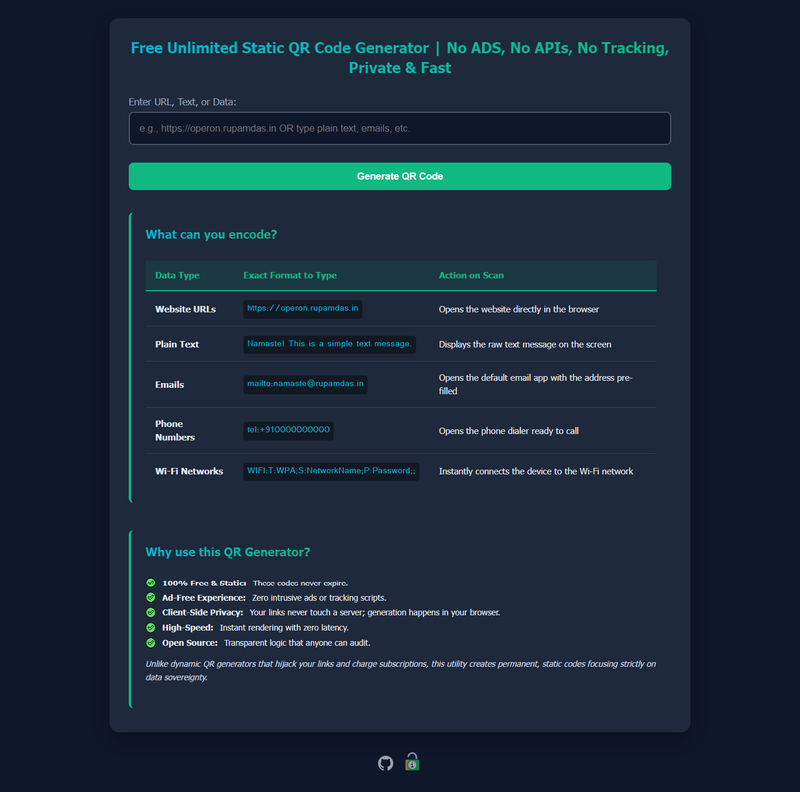

# 🔳 Sovereign QR Engine

A 100% client-side, high-performance static QR code generator built for total data privacy and zero-latency execution.

## ⚙️ Overview

This utility allows for the instantaneous cryptographic encoding of text, URLs, and network data into high-fidelity QR matrices. Engineered specifically to combat the rise of predatory "dynamic" QR subscriptions, this tool ensures:

*   **Absolute Data Sovereignty:** No URLs, text, or sensitive data are ever sent to an external server. Matrix calculation occurs entirely within the browser's local DOM.
*   **Permanent & Unbreakable:** Generates strictly *static* codes. No middleware redirects, no tracking pixels, and no link expiration.
*   **Zero Egress & API Dependency:** By offloading processing entirely to the client side, the infrastructure requires zero backend overhead, zero API keys, and zero database queries.

## 🛠️ Technical Specifications

*   **Core Rendering Engine:** `qrcode.js` (Client-side HTML5 Canvas manipulation).
*   **Output Protocol:** Base64 encoded high-resolution PNG extraction.
*   **Architecture:** Pure Static HTML / Vanilla JS / CSS (Serverless/Edge-native).
*   **Efficiency:** Near-zero latency execution, fully capable of running completely offline once cached in the browser.

## 📡 Supported Encoding Protocols

| Data Type | Syntax Architecture | Execution on Scan |
| :--- | :--- | :--- |
| **Web Routing** | `https://operon.rupamdas.in` | Direct browser navigation |
| **Raw Strings** | `Namaste! This is a simple text message.` | Native text display |
| **Comms (Email)** | `mailto:namaste@rupamdas.in` | Triggers default mail client |
| **Comms (Voice)** | `tel:+910000000000` | Triggers native phone dialer |
| **Network Access** | `WIFI:T:WPA;S:NetworkName;P:Password;;` | Automates Wi-Fi handshake |

## 🚀 Deployment Workflow

1.  **Input:** User supplies a raw string or URI routing scheme.
2.  **Transform:** Client-side JavaScript calculates the error-correction matrix and paints it directly to the canvas.
3.  **Delivery:** The canvas is converted into a localized `.png` payload for immediate physical or digital distribution.

## ⚖️ Operational Principles

This utility is built on the philosophy of **Sovereign Engineering**. By eliminating third-party routing and server-side data harvesting, we guarantee that the user retains absolute ownership over both their input data and their physical output. Generating a static matrix should be a fundamental utility, not a monetized subscription trap.
